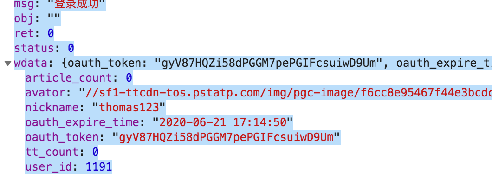
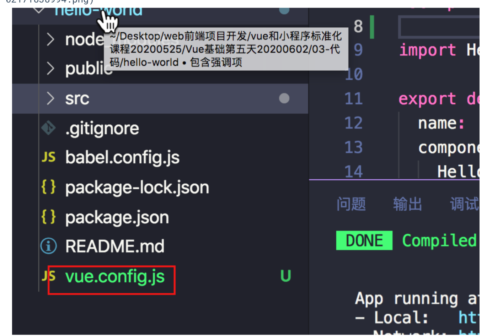
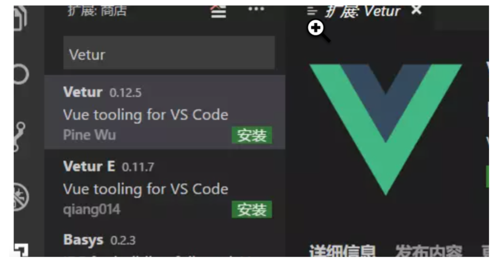
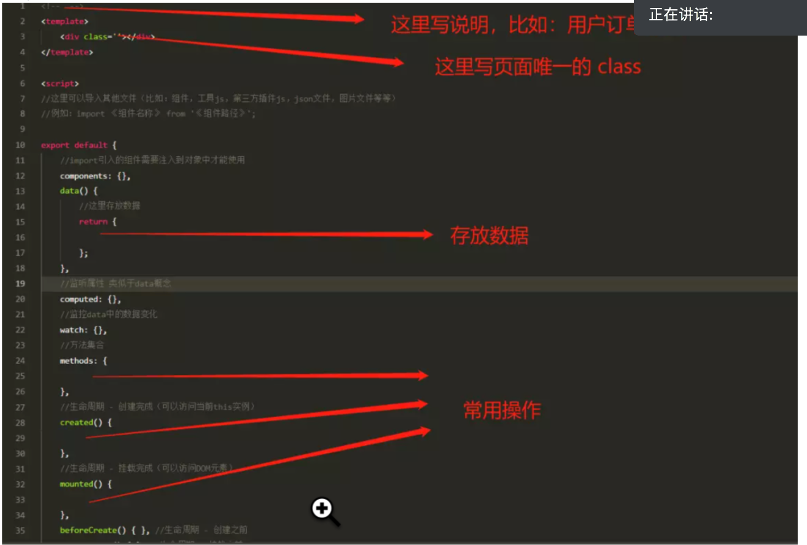

# 1. 项目技术相关
## 1.1. VUE2技术
## 1.2. VUE2插件 Axios
## 1.3. VUE2插件 ElementUI

# 2. 帮助文档

1. [VUE2官方安装指导](https://cn.vuejs.org/v2/guide/installation.html)
2. [ElementUI安装指导](https://element.eleme.cn/#/zh-CN/component/installation)
2. [Axios安装指导](https://github.com/axios/axios)
3. [音乐接口](https://github.com/Binaryify/NeteaseCloudMusicApi)

# 3. 项目搭建

## 3.1. VUE2安装

## 3.2. VUE2目录结构

| 目录名     | 作用             |
| ---------- | ---------------- |
| build     | 生产打包文件夹     |
| config | VUE系统配置文件夹        |
| node_modules | node组件依赖        |
| src | 代码逻辑文件夹        |
| test | 测试单元        |
| static | 纯静态资源，不会被wabpack构建        |
| /src/router | 路由文件        |
| /src/vuex/store.js | 状态管理器 & localStorage本地保存器|

## 3.3. 搭建项目的页面

| 页面名称     | 名称         |
| ------------ | ------------ |
| 首页         | /src/components/Index.vue |
| 导航         | /src/components/Nav/Nav.vue |
| 个人中心         | /src/components/User/UserCenter.vue |
| 文章列表         | /src/components/News/News.vue |
| 文章详情         | /src/components/News/NewsListDetail.vue |
| 登录         | /src/components/User/UserLogin.vue |
| 注册         | /src/components/User/UserSign.vue |
| 个人资料     | /src/components/User/UserData.vue |
| 个人文章列表     | /src/components/User/UserCenterArticle.vue |
| 个人头条列表    | /src/components/User/UserCenterTT.vue |

### 3.3.1 首页技术介绍


# 4. 接口数据

## 4.1. 头条接口

1. 用户注册接口

   ```json
   @url http://tt.linweiqin.com/api/tt/createUser
   @method post
   @params username,password
   @return msg,ret,wdata
   ```

2. 用户登录接口

   ```json
   @url http://tt.linweiqin.com/api/tt/loginCheck
   @method post
   @params username,password
   @return msg,ret,wdata
   
```

登陆成功



登陆失败


3. 文章创建接口

```json
@url http://tt.linweiqin.com/api/tt/createArticle
@method post
@params content,img,title,oauth_token
@return msg,ret,wdata
```

1. 头条创建接口

   ```json
   @url http://tt.linweiqin.com/api/tt/createTT
   @method post
   @params content,imgs（字符串，逗号隔开）,oauth_token
   @return msg,ret,wdata
   ```

2. 用户退出接口

   ```json
   @url http://tt.linweiqin.com/api/tt/logout
   @method post
   @params 
   @return msg,ret,wdata
   ```

3. 文章列表接口

   ```json
   @url http://tt.linweiqin.com/api/tt/getArticles
   @method post
   @params lastid
   @return msg,ret,wdata
   ```

4. 用户文章列表

   ```json
   @url http://tt.linweiqin.com/api/tt/getArticlesByType
   @method post
   @params type,oauth_token
   @return msg,ret,wdata
   ```

5. 文章删除接口

   ```json
   @url http://tt.linweiqin.com/api/tt/deleteArticle
   @method post
   @params nid,oauth_token
   @return msg,ret,wdata
   ```


8. 用户个人信息修改

   ```json
   @url http://tt.linweiqin.com/api/tt/updateUserInfo
   @method post
   @params nickname,avator
   @return msg,ret,wdata
   ```

9. 用户密码修改

   ```json
   @url http://tt.linweiqin.com/api/tt/updatePassword
   @method post
   @params currentPassword,updatePassword
   @return msg,ret,wdata
   ```

10. 文章、头条详情接口

   ```json
   @url http://tt.linweiqin.com/api/tt/getArticleById
   @method post
   @params nid
   @return msg,ret,wdata
   ```


# 5. Vue-cli 3.0 关闭eslint

在根目录下新建` vue.config.js` 文件



输入

*module*.*exports* = {

  lintOnSave: false

}

# 6. 安装less支持

```bash
npm i less less-loader --save
```

# 一键生成.vue模版

1. ### 安装一个插件，识别vue文件



2. #### 新建代码片段

```bash
文件-->首选项-->用户代码片段-->点击新建代码片段--取名vue.json 确定
```

3. #### 粘入自己写的.vue模板

   ```json
   {
       "Print to console": {
           "prefix": "vue",
           "body": [
               "<!-- $1 -->",
               "<template>",
               "<div class='$2'>$5</div>",
               "</template>",
               "",
               "<script>",
               "//这里可以导入其他文件（比如：组件，工具js，第三方插件js，json文件，图片文件等等）",
               "//例如：import 《组件名称》 from '《组件路径》';",
               "",
               "export default {",
               "//import引入的组件需要注入到对象中才能使用",
               "components: {},",
               "data() {",
               "//这里存放数据",
               "return {",
               "",
               "};",
               "},",
               "//监听属性 类似于data概念",
               "computed: {},",
               "//监控data中的数据变化",
               "watch: {},",
               "//方法集合",
               "methods: {",
               "",
               "},",
               "//生命周期 - 创建完成（可以访问当前this实例）",
               "created() {",
               "",
               "},",
               "//生命周期 - 挂载完成（可以访问DOM元素）",
               "mounted() {",
               "",
               "},",
               "beforeCreate() {}, //生命周期 - 创建之前",
               "beforeMount() {}, //生命周期 - 挂载之前",
               "beforeUpdate() {}, //生命周期 - 更新之前",
               "updated() {}, //生命周期 - 更新之后",
               "beforeDestroy() {}, //生命周期 - 销毁之前",
               "destroyed() {}, //生命周期 - 销毁完成",
               "activated() {}, //如果页面有keep-alive缓存功能，这个函数会触发",
               "}",
               "</script>",
               "<style  scoped>",
               "$4",
               "</style>"
           ],
           "description": "Log output to console"
       }
   }
   
   
   ```

   

上面代码中的 "prefix": "vue", 就是快捷键；保存好之后，新建.vue结尾的文件试试,新建vue文件之后，输入vue 按键盘的tab就行。




